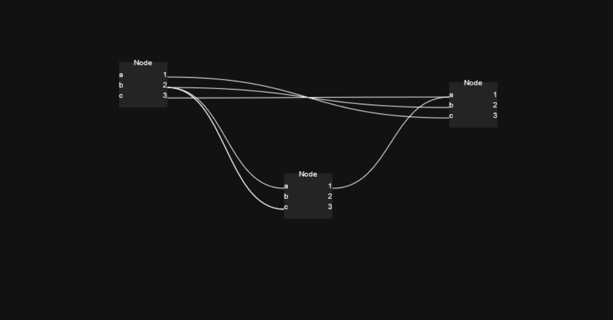

# glsl-graph

Attempting to make a node based GLSL editor

Also an exercise at making a not terrible node editor

I like using blender a lot, so this will probably mimick blender's Shader Nodes editor for the most part input-wise.

## Implemented
- Node rendering
- Connection rendering
- Dynamic input/output ports
- Input:
  - G : Grab (move) similar to blender
  - B : Box Select (similar to blender)
  - Click (+Shift) : Select (similar to blender)
  - C : Start Connect (not final, debugging purposes, hover over a node then press C, then click on another node)
- Box Selection
- Click selection
- Multi selection with Shift
- A ModeHandler to handle different states of editing

